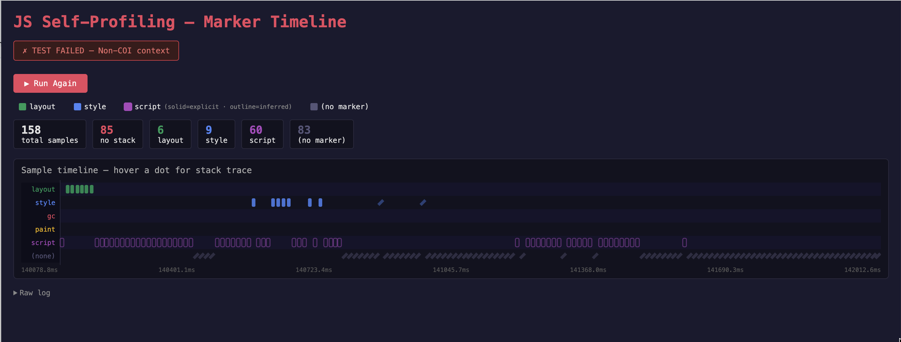
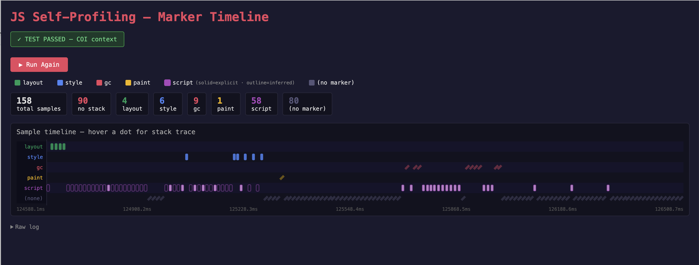

# JS Self-Profiling: Safe Markers in Non-Isolated Contexts — Timeline Visualisation

> **Based on the original demo by [Victor Huang](https://github.com/victorhuangwq)** —
> see the upstream repo at [victorhuangwq/js-profiler-markers-demo](https://github.com/victorhuangwq/js-profiler-markers-demo)
> and his README for the full background on the Chromium change.

This fork extends Victor's functional marker test with an **interactive visual timeline** to make it easier to see exactly when and how often each marker type fires, and to inspect the call stack behind each sample.

---

## Screenshots

**Non-COI context** (`layout` + `style` only):


**COI context** (all five marker types):


---

## What this fork adds

### Visual sample timeline

After running the profiling test, every collected sample is plotted on a canvas timeline — one horizontal lane per marker category, left-to-right by timestamp.

| Visual encoding | Meaning |
|-----------------|---------|
| Solid rectangle | Sample has an associated stack (`stackId` is set) |
| Rotated diamond, faded | Sample has **no stack** (`stackId` is null) |
| Lane colour | Marker category (see legend below) |

**Marker colours:**

| Marker | Colour |
|--------|--------|
| `layout` | 🟢 green |
| `style` | 🔵 blue |
| `gc` | 🔴 red |
| `paint` | 🟡 yellow |
| `script` | 🟣 purple |
| `(none)` | ⬛ grey |

The legend is **clickable** — toggle any category on/off to reduce noise.

### Hover tooltip with resolved stack trace

Hovering a sample dot shows:
- Marker type and timestamp (to microsecond precision)
- `stackId` value (or a red warning if absent)
- Full call stack, resolved from the profiler trace's linked-list structure, displayed leaf-first with file/line/column

### "No marker + has stack" → inferred as `script`

The JS Self-Profiling API emits samples without a `marker` field during ordinary JS execution. Victor's original demo counted these as a separate `(no marker)` bucket. This fork reclassifies them:

- **No marker + `stackId` set** → treated as `script` (JS was executing; the engine just doesn't emit a dedicated marker for it)
- **No marker + no `stackId`** → stays as `(none)` (genuinely empty sample — no activity recorded)

Inferred `script` samples are flagged with a `✦` badge in the tooltip so you can distinguish them from samples that carried an explicit `script` marker from the engine.

### Stats bar

A summary row above the timeline shows total sample count, no-stack count, and a per-marker breakdown — updated on every run.

### Responsive & HiDPI-aware

The canvas redraws on window resize and is scaled by `devicePixelRatio` to stay sharp on retina displays.

---

## What changed in Chromium (from Victor's work)

The JS Self-Profiling API's `ProfilerSample.marker` field was previously gated behind Cross-Origin Isolation (COI). This CL moves filtering to runtime — `layout` and `style` markers are now available in all contexts, while `gc`, `paint`, and `script` remain behind COI.

| Context | `layout` | `style` | `gc` | `paint` | `script` |
|---------|----------|---------|------|---------|----------|
| Non-isolated (no COOP/COEP) | ✓ | ✓ | — | — | — |
| Cross-Origin Isolated | ✓ | ✓ | ✓ | ✓ | ✓ |

---

## Running the demo

### 1. Start the server

```bash
node test-server.cjs
```

| Route | COI | Expected markers |
|-------|-----|-----------------|
| `http://localhost:8123/no-coi` | ✗ | `layout`, `style` |
| `http://localhost:8123/coi` | ✓ | all five |

### 2. Launch Chrome Canary with the required flags

```bash
/Applications/Google\ Chrome\ Canary.app/Contents/MacOS/Google\ Chrome\ Canary \
  --enable-features=ExperimentalJSProfilerMarkers \
  --enable-experimental-web-platform-features \
  http://localhost:8123/no-coi \
  http://localhost:8123/coi
```

### 3. Click "Run Profiling Test" on either page

The timeline appears below the button once profiling completes. Hover any dot to inspect its stack.

---

## Links

- **Original demo:** [victorhuangwq/js-profiler-markers-demo](https://github.com/victorhuangwq/js-profiler-markers-demo) by [Victor Huang](https://github.com/victorhuangwq)
- **Chromium CL:** [chromium-review.googlesource.com/c/chromium/src/+/6012522](https://chromium-review.googlesource.com/c/chromium/src/+/6012522)
- **Spec PR:** [WICG/js-self-profiling#85](https://github.com/WICG/js-self-profiling/pull/85)
- **Edge Explainer:** [MSEdgeExplainers/ConditionalMarkersExposure](https://github.com/MicrosoftEdge/MSEdgeExplainers/blob/main/ConditionalMarkersExposure/explainer.md)
- **Security discussion:** [WICG/js-self-profiling#61](https://github.com/WICG/js-self-profiling/issues/61)
